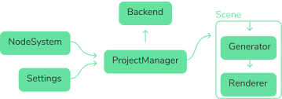

## Architecture

This Repository is split into several packages, which are manage with pnpm, and bundled using vite.

## Modules

### [ProjectManager](frontend/src/components/project-manager)

The projectmanager is responsible for loading/storing/uploading projects.

### [Settings](frontend/src/components/settings-manager)

Settings are a bunch of global settings, which are not bound to one single project.

### [NodeSystem](packages/nodesystem)

The NodeSystem is doing all the changes to a project. When a change is done the output of the nodesystem is send to the project manager;

### [Scene](frontend/src/components/scene)

The scene is responsible for taking the output of the nodesystem and the current settings and generating and displaying the final 3d model.

- ### [Generator](packages/generator)
- ### [Renderer](packages/renderer)

### [UI](packages/ui)

The ui package consists of individual Svelte components used across the project.

### [Renderer](packages/renderer)

The Renderer renders a 3d model to a canvas element.

### [Nodes](packages/nodes)

The Nodes Package contains all the nodes which are loaded by the nodesystem.

### [Geometry](packages/geometry)

The Geometry package consists of many functions which create 3D elements.

### [Helpers](packages/helpers)

The Helpers package contains a lot of helper functions used across the plantarium project.

### [Backend](backend)

The Backend contains the server code.
