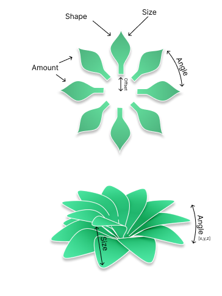

# Flower Node

This was a proposal by @Nilmanduil on GitHub, I was thinking about this before but have not written anything down yet.

I think it may be time to create an instance node, where we can feed in a model, and it gets instanced along a stem...

On the upsides this would make the system more flexible and allow for more freedom, think nuts, flowers, seedpods, but it would introduce an extra node you would need to use every time you want to simply create leaves...

## Links/References

[Most Popular Flower Types](https://www.1800flowers.com/blog/flower-facts/flower-types/)
